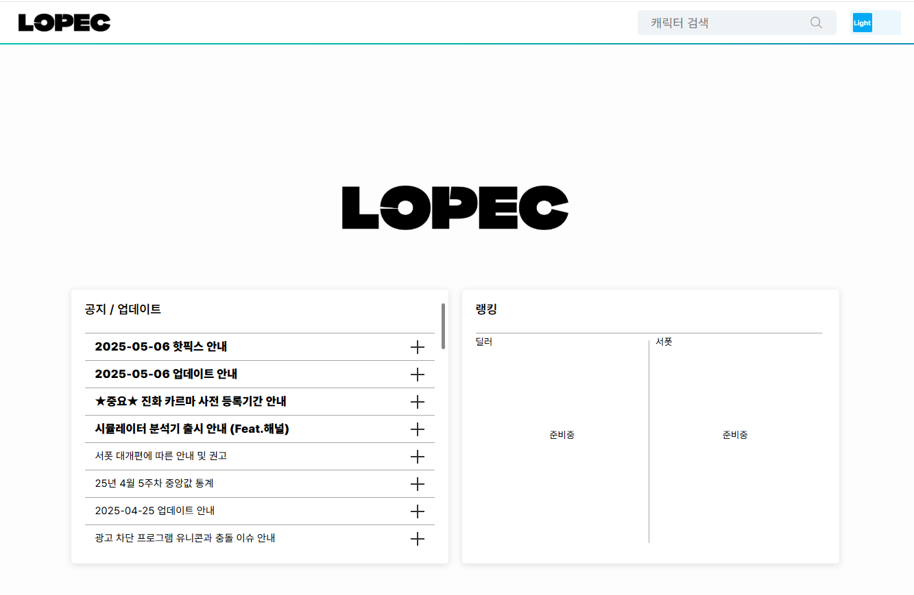
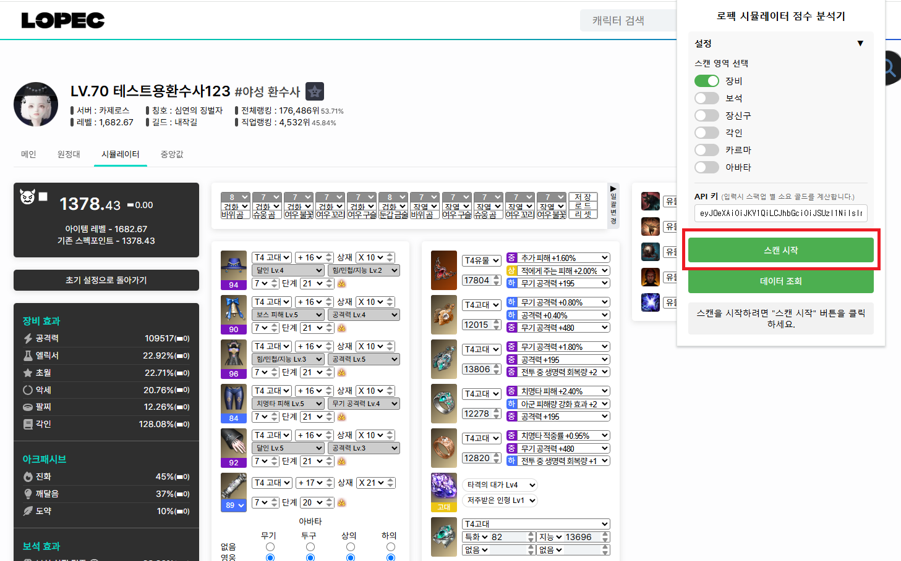
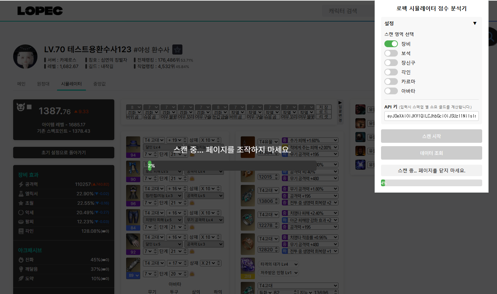
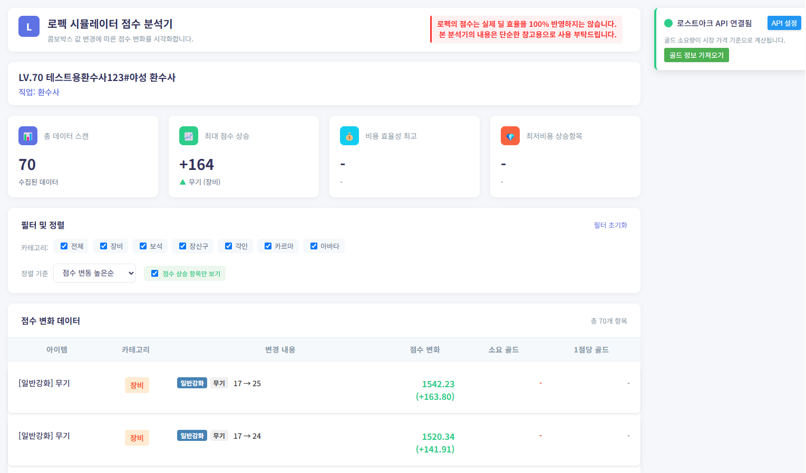
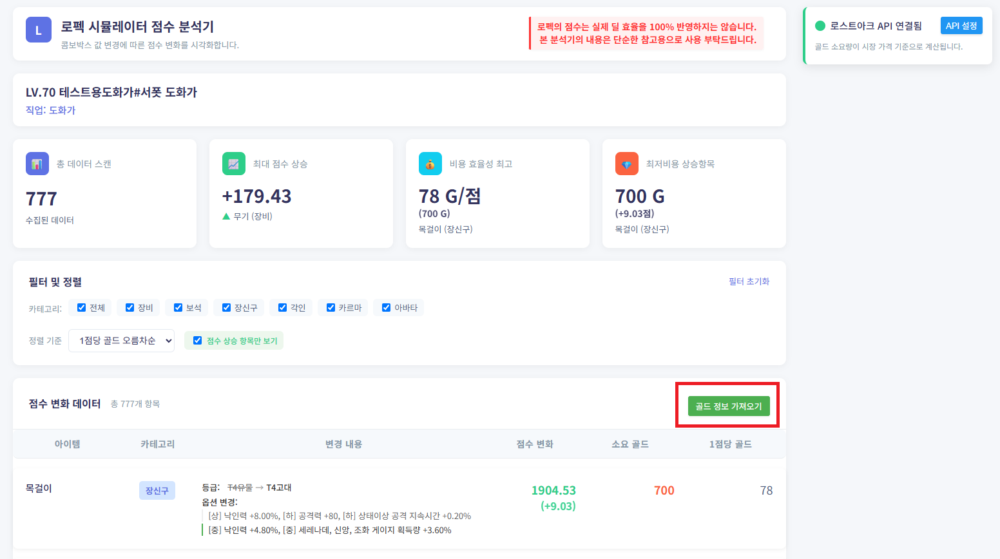

# 로펙 시뮬레이터 점수분석기 사용법

## 1. 로펙 시뮬레이터 분석기를 다운받은 뒤 로펙에 이동합니다.

- 다운로드 링크 : [로펙 시뮬레이터 점수 분석기](https://chromewebstore.google.com/detail/hjandoglibodddfdpbpcfkcldghbalhl?utm_source=item-share-cb)
- 로펙 링크 : [로펙](https://lopec.kr/)

## 2. 찾고자하는 이름을 검색후 시뮬레이션으로 이동합니다.

## 3. 우측 상단 확장프로그램에서 로펙 시뮬레이터 분석기를 실행한 뒤 원하는 옵션을 지정하여 스캔을 시작합니다.
(스캔 양에 따라 소요시간이 달라집니다.)

## 4. 스캔을 시작하면 화면에 로딩바가 표기됩니다.

## 5. 스캔이 완료되면 데이터 조회 버튼으로 조회 페이지로 이동합니다.

## 6. 데이터 조회 화면에서 스캔한 내역을를 확인 할 수 있습니다.

## 7. api 입력 후 골드정보 가저오기 버튼을 누르면 현재 시세를 기준으로 강화에 필요한 예상 비용을 확인 가능합니다.
### api는 1회만 입력하면 계속 사용 가능합니다.

